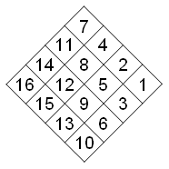

# Отель / 1319

* Ограничение времени: 1.0 секунды
* Ограничение памяти: 64 МБ

— Ох уж мне эти дизайнеры! У вас-то, программистов таких проблем нет, а нам эти эстеты всю жизнь портят. Вот представь, в нашу мастерскую пришли из компании, строящей новую гостиницу и принесли эскиз. Говорят, что ЭТО им придумал крутой дизайнер. Говорят, что за разработку ЭТОГО они заплатили дизайнеру кучу денег. И раз деньги уже заплачены, то придется ЭТО делать. В общем-то, ничего особенного ЭТО из себя не представляет — просто набор полочек, куда портье складывает корреспонденцию для постояльцев. Во всех нормальных гостиницах такие есть — висит себе стеллажик с множеством ячеек, на каждой номерок написан. Но ЭТОТ дизайнер перевернул все с ног на голову. Вернее положил обычный квадратный блок ячеек на бок. То есть не совсем положил на бок, а поставил на угол! И ячейки нумеруются не как обычно, а справа налево и сверху вниз! Ну конечно смотреть при этом надо на стеллаж уже стоящий на углу. Как же у меня мастер будет номерки приделывать, он ведь смотрит на стеллаж стоящий нормально, он же на четвертом уже запутается. Я и сам на 7 уже путаюсь. В общем, таких дизайнеров надо самих заставлять ячейки нумеровать.

— Слушай, а раз уж ты такой крутой программист, может, поможешь? Мне позарез нужна распечатанная таблица с расстановкой номерков по ячейкам, только не так, как ЭТО будет висеть на стене, а так, как ЭТО будет стоять у меня в мастерской. Ну я понимаю, что ты занят, но ты всегда занят. Ну и что, что чемпионат Урала на носу. Да плюнь ты на эти тесты, не сделаешь — ничего плохого не случится. А сам не можешь, так заставь этих участников делать, они ведь тоже программисты, мирового уровня, говоришь, должны справиться! Что они, не смогут по размеру квадрата сделать мне нужную табличку? Ни за что не поверю! Ну вот и прекрасно, после чемпионата я зайду за табличкой!

## Исходные данные

Целое число N (1 ≤ N ≤ 100) – размер таблички.

## Результат

Табличка, помеченная циферками, как она будет стоять в мастерской. Номер один должен находиться в правом верхнем углу, далее ячейки нумеруются по диагоналям сверху вниз, последний номер (N*N) стоит в левом нижнем углу.

## Пример

| исходные данные | результат |
| --------------- | --------- |
| 3               | `4 2 1`   |
|                 | `7 5 3`   |
|                 | `9 8 6`   |

---

* Автор задачи: Станислав Васильев
* Источник задачи: VIII Командный студенческий чемпионат Урала по программированию. Екатеринбург, 11-16 марта 2004 г.
* Сложность: 42