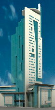

# Баяны / 1563

* Ограничение времени: 1.0 секунды
* Ограничение памяти: 64 МБ

Как известно, в небоскрёбах часто располагаются магазины, в которые ходят гламурные модницы. Любимое занятие блондинки Анжелы — шоппинг. И сегодня у нее праздник — поход за покупками в новый небоскрёб Призма. Для начала она решила обойти там все магазины. Но, как оказалось, Призма настолько большая, что в ней встречаются магазины разных фирм по нескольку раз. Каждый раз, когда Анжела видела магазин той же фирмы, что она уже посетила, то произносила: «БАЯН», — и шла дальше.

Сколько раз Анжела сказала «БАЯН», пока обходила все магазины?

## Исходные данные

В первой строке записано целое число N — количество магазинов в Призме (1 ≤ N ≤ 1000). В каждой из следующих N строк записано название магазина — строка из латинских букв и пробелов длиной от 1 до 30. Известно, что в Призме нет магазинов, названия которых отличаются только регистром.

## Результат

Выведите количество магазинов, которые не посетила Анжела.

## Пример

| исходные данные         | результат |
| ----------------------- | --------- |
| 12                      | `3`       |
| ESPRIT                  |           |
| Nice Connection         |           |
| Camelot                 |           |
| Adilisik                |           |
| Lady and Gentleman City |           |
| MEXX                    |           |
| Camelot                 |           |
| Sultanna Frantsuzova    |           |
| Camaieu                 |           |
| MEXX                    |           |
| Axara                   |           |
| Camelot                 |           |

---

* Автор задачи: Владимир Яковлев
* Источник задачи: XII Чемпионат УрГУ по программированию, 6 октября, 2007
* Сложность: 63