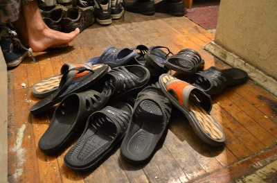

# Утро сороконожки / 1876

* Ограничение времени: 0.5 секунды
* Ограничение памяти: 64 МБ

У сороконожки 40 левых ножек и 40 правых ножек. Под кроватью у сороконожки a левых тапочек и b правых тапочек. Сороконожка, просыпаясь, надевает тапочки. Для этого она засовывает под кровать первую левую ножку и надевает первый попавшийся тапочек, тратя на это одну секунду. Если тапочек оказывается левым, то она переходит ко второй левой ножке. Если же он оказывается правым, она переодевает его на какую-нибудь необутую правую ножку, тратя ещё одну секунду, то есть всего на такой тапочек уходит две секунды. Если все правые ножки уже обуты, то она снимает тапочек и кидает его в угол комнаты, тратя на это одну секунду, то есть на такой тапочек сороконожка тратит также две секунды. Процесс продолжается до тех пор, пока все левые ножки не окажутся в левых тапочках. Затем сороконожка аналогичным образом начинает надевать правые тапочки, продолжая до тех пор, пока не будут обуты все правые ножки.

Сегодня сороконожка встала не с той ножки, поэтому она готовится к худшему. Несмотря на это, она, как обычно, начинает обуваться с левой ножки. Сколько секунд понадобится сороконожке на утреннее обувание?

## Исходные данные

В единственной строке записаны целые числа a и b (40 ≤ a, b ≤ 100).

## Результат

Выведите, сколько секунд понадобится в худшем случае сороконожке на утреннее обувание.

## Пример

| исходные данные | результат |
| --------------- | --------- |
| 40              | 120       |

---

* Автор задачи: Михаил Рубинчик
* Источник задачи: Уральская региональная командная олимпиада по программированию 2011
* Сложность: 51